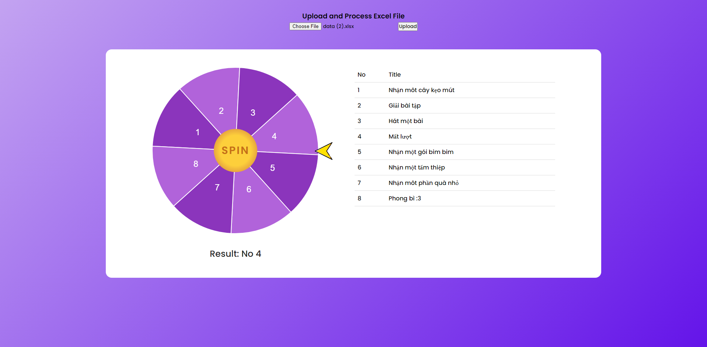

# Spin Wheel Maker

**Spin Wheel Maker** is a web-based tool that allows users to create a customizable spin wheel based on the contents of an uploaded XLSX file. The first row of the file is treated as a header, and the data from the file is processed to create a visual spin wheel. The tool supports weighted randomness for the spin results.

## Features

- Upload XLSX files with data and weights
- Automatically generate a spin wheel based on the data
- Support for weighted random selection
- Simple user interface with easy file upload and interaction
- Common features and interface of a spin wheel

## Getting Started

Follow these steps to open and use the **Spin Wheel Maker** on your local machine:

### Prerequisites

You will need a browser to open the web application. The tool works with modern browsers such as Chrome, Firefox, Safari, or Edge.

### Steps to Use

1. **Clone the repository** (or you can make it easier by downloading the .zip file and extracting):
   - If you haven't cloned the repository yet, open your terminal and run the following command:
     ```bash
     git clone https://github.com/quoctoanpk2511/spin-wheel-maker.git
     ```
   - Navigate to the directory:
     ```bash
     cd spin-wheel-maker
     ```

2. **Open the web application**:
   - Locate the `index.html` file inside the project folder.
   - Open the `index.html` file using any modern web browser:
     - Right-click on the file and select "Open With," then choose your browser.
     - Or, simply drag and drop the file into your browser window.

3. **Upload your XLSX file**:
   - After the web page opens, you will see an option to upload a file.
   - Click the **Choose File** button and select your `.xlsx` file. (You can also use the `data.xlsx` file in the extracted folder.)
   - Click the **Upload** button to upload and read your `.xlsx` file.
   - The file should have the first row as a header, and each subsequent row should contain the data for the spin wheel.

4. **View and interact with the spin wheel**:
   - Once the file is uploaded, the spin wheel will be generated based on the data.
   - You can now interact with the wheel and spin it to see the results based on the weighted random logic implemented.

## File Requirements

- The XLSX file must have the first row as the header.
- The id column will be the label displayed above the wheel.
- Each subsequent row should contain the data points for the spin wheel, including the title and the weight.

## Example File Format

The header needs to be set like the sample file.
| id | title      | weight |
|----|------------|--------|
|1   | Option 1   | 1      |
|2   | Option 2   | 3      |
|3   | Option 3   | 1      |

## Demo

